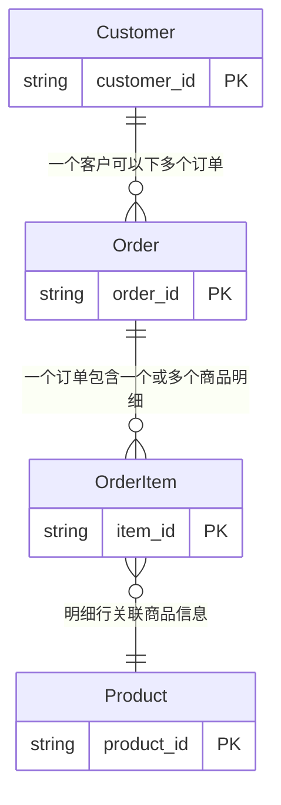

# 业务域：电商订单分析

> **自动生成时间**: 2026-07-14 12:20:06
> **域 ID**: `ecommerce_order`
> **版本**: 1.0.0

---

**描述**: 示例业务域：电商平台订单全链路分析，覆盖下单、支付、发货、签收等核心环节

## 1. 关系拓扑图 (Relationship Map)

## 2. 核心实体 (Entities)
| 实体名 | 主键 | 属性数 | 物理来源 | 描述 |
| :--- | :--- | :--- | :--- | :--- |
| Customer | `customer_id` | 5 | `dw_demo.dim_customer_info_df` | 客户实体，包含基本信息和会员等级 |
| Order | `order_id` | 9 | `dw_demo.dwd_order_info_di` | 订单主实体，记录订单全生命周期状态 |
| OrderItem | `item_id` | 6 | `dw_demo.dwd_order_item_di` | 订单明细行，一个订单可包含多个商品明细 |
| Product | `product_id` | 5 | `dw_demo.dim_product_info_df` | 商品维度实体 |

## 3. 层级分类 (Hierarchy)
**OrderStatus**
- **PendingPayment**: 待支付：订单已创建但尚未支付
  - 规则: `order_status = '10'`
- **Paid**: 已支付：支付成功，等待发货
  - 规则: `order_status = '20'`
- **Shipped**: 已发货：仓库已出库
  - 规则: `order_status = '30'`
- **Completed**: 已签收：客户确认收货
  - 规则: `order_status = '40'`
- **Cancelled**: 已取消：客户主动取消或超时未支付
  - 规则: `order_status = '50'`

## 4. 指标口径 (Metrics)
| 指标名称 | 定义 | 计算式 | 过滤条件 | 单位 | 预警阈值 |
| :--- | :--- | :--- | :--- | :--- | :--- |
| 成交总额 (GMV) | 已支付订单的实付金额总和 | `SUM(pay_amount)` | `order_status IN ('20','30','40')` | 元 | - |
| 订单数 | 当日创建的订单总数 | `COUNT(DISTINCT order_id)` | `-` | 单 | - |
| 支付转化率 | 已支付订单数 / 总下单数 | `COUNT(CASE WHEN order_status >= '20' THEN 1 END) * 100.0 / COUNT(DISTINCT order_id)` | `-` | % | 低于 70% 需预警 |
| 客单价 | GMV / 已支付订单数 | `SUM(pay_amount) / NULLIF(COUNT(CASE WHEN order_status >= '20' THEN 1 END), 0)` | `-` | 元/单 | - |

## 7. 领域公理 (Axioms)
| 编号 | 公理描述 | 形式化表达 |
| :--- | :--- | :--- |
| AX-001 | 每个订单明细必然关联且仅关联一个订单 | `forall i in OrderItem, exists! o in Order: i.order_id = o.order_id` |
| AX-002 | 订单金额守恒：订单总金额等于明细金额之和 | `forall o in Order: o.total_amount = SUM(i.item_amount for i in OrderItem where i.order_id = o.order_id)` |
| AX-003 | 实付金额非负 | `forall o in Order: o.pay_amount >= 0` |

## 8. 业务规则 (Business Rules)
| 规则名 | 内容 |
| :--- | :--- |
| GMV口径 | 仅统计已支付及以上状态（order_status >= '20'）的订单，待支付和已取消不计入 |
| 金额校验 | pay_amount = total_amount - discount_amount，误差超过 0.01 元需标记异常 |
| 明细金额校验 | item_amount = quantity * unit_price，不一致则标记为数据质量问题 |

## 9. 分区与过滤规则 (Filter Rules)
| 规则名 | 说明 | 条件 |
| :--- | :--- | :--- |
| order_partition | 订单表取 T-1 日分区 | `inc_day = '$[time(yyyyMMdd,-1d)]'` |
| valid_order | 有效订单：排除已取消 | `order_status != '50'` |
