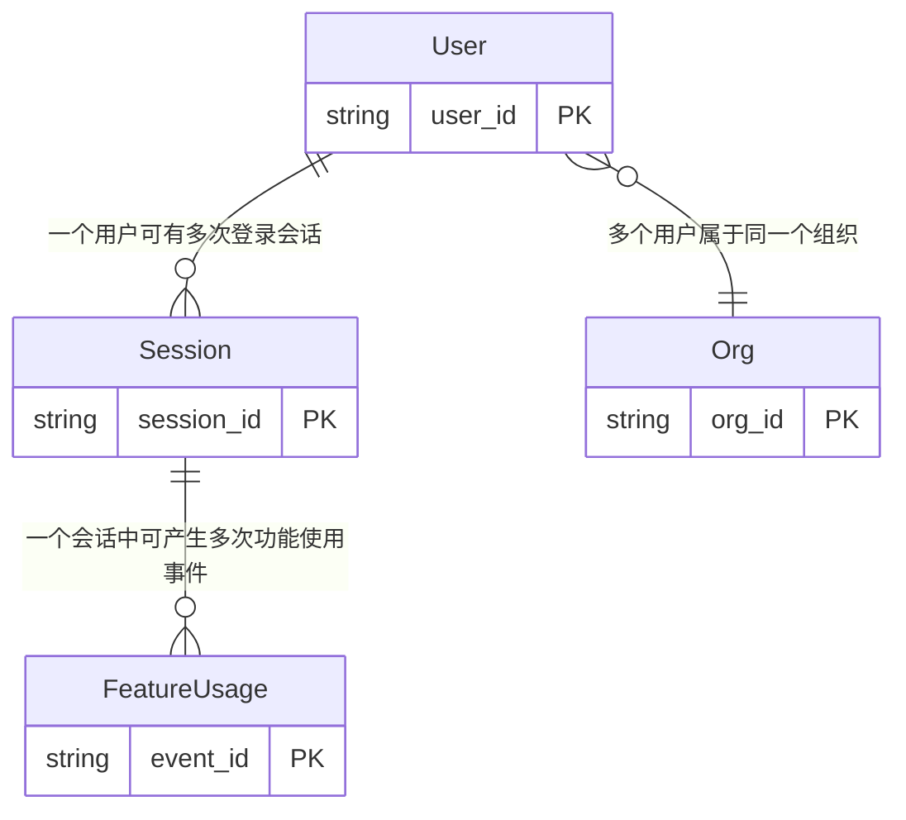

# 业务域：SaaS 用户活跃分析

> **自动生成时间**: 2026-07-09 16:11:31
> **域 ID**: `saas_user_activity`
> **版本**: 1.0.0

---

**描述**: 示例业务域：SaaS 产品用户活跃度分析，覆盖 DAU/MAU、留存率、功能渗透率等核心指标

## 1. 关系拓扑图 (Relationship Map)

## 2. 核心实体 (Entities)
| 实体名 | 主键 | 属性数 | 物理来源 | 描述 |
| :--- | :--- | :--- | :--- | :--- |
| User | `user_id` | 6 | `dw_demo.dim_user_info_df` | 用户实体，包含订阅计划和账号状态 |
| Session | `session_id` | 7 | `dw_demo.dwd_user_session_di` | 用户登录会话实体，一次登录产生一条记录 |
| FeatureUsage | `event_id` | 7 | `dw_demo.dwd_feature_usage_di` | 功能使用事件，记录用户在产品内的每一次操作 |
| Org | `org_id` | 4 | `dw_demo.dim_org_info_df` | 组织实体，SaaS 以组织为订阅单位 |

## 4. 指标口径 (Metrics)
| 指标名称 | 定义 | 计算式 | 过滤条件 | 单位 | 预警阈值 |
| :--- | :--- | :--- | :--- | :--- | :--- |
| 日活跃用户数 (DAU) | 当日有登录会话的去重用户数 | `COUNT(DISTINCT user_id)` | `inc_day = '$[time(yyyyMMdd,-1d)]'` | 人 | - |
| 月活跃用户数 (MAU) | 近 30 天内有登录会话的去重用户数 | `COUNT(DISTINCT user_id)` | `inc_day BETWEEN '$[time(yyyyMMdd,-30d)]' AND '$[time(yyyyMMdd,-1d)]'` | 人 | - |
| 平均会话时长 | 当日登录会话的平均时长 | `AVG(duration_seconds)` | `inc_day = '$[time(yyyyMMdd,-1d)]' AND duration_seconds > 0` | 秒 | - |
| 功能渗透率 | 使用过指定功能的用户数 / DAU | `COUNT(DISTINCT CASE WHEN feature_name = '${target}' THEN user_id END) * 100.0 / NULLIF(COUNT(DISTINCT user_id), 0)` | `-` | % | 核心功能低于 30% 需关注 |

## 7. 领域公理 (Axioms)
| 编号 | 公理描述 | 形式化表达 |
| :--- | :--- | :--- |
| AX-001 | 每个功能使用事件必然关联且仅关联一个会话 | `forall f in FeatureUsage, exists! s in Session: f.session_id = s.session_id` |
| AX-002 | 会话时长非负 | `forall s in Session: s.duration_seconds >= 0` |
| AX-003 | DAU 是 MAU 的子集：日活跃用户必然属于当月活跃用户 | `forall u: DAU(u, day) -> MAU(u, month_of(day))` |

## 8. 业务规则 (Business Rules)
| 规则名 | 内容 |
| :--- | :--- |
| 活跃定义 | 用户当日至少有一条 Session 记录即视为活跃，不论是否产生功能使用事件 |
| 流失定义 | 连续 30 天无 Session 记录的用户标记为 churned |
| 会话时长上限 | duration_seconds 超过 86400（24小时）视为异常，需截断处理 |

## 9. 分区与过滤规则 (Filter Rules)
| 规则名 | 说明 | 条件 |
| :--- | :--- | :--- |
| session_partition | 会话表取 T-1 日分区 | `inc_day = '$[time(yyyyMMdd,-1d)]'` |
| active_user | 有效用户：排除已停用和已流失 | `status = 'active'` |
