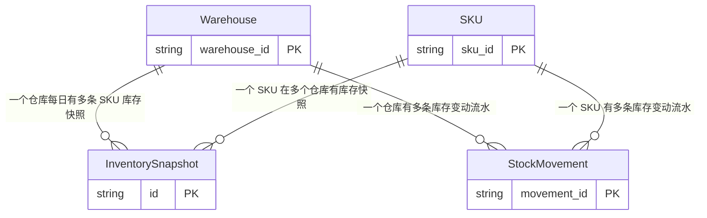

# 业务域：供应链库存分析

> **自动生成时间**: 2026-07-09 16:43:18
> **域 ID**: `supply_chain_inventory`
> **版本**: 1.0.0

---

**描述**: 示例业务域：供应链库存周转与补货分析，覆盖库存水位、周转天数、缺货预警等核心场景

## 1. 关系拓扑图 (Relationship Map)

## 2. 核心实体 (Entities)
| 实体名 | 主键 | 属性数 | 物理来源 | 描述 |
| :--- | :--- | :--- | :--- | :--- |
| Warehouse | `warehouse_id` | 5 | `dw_demo.dim_warehouse_info_df` | 仓库实体 |
| SKU | `sku_id` | 6 | `dw_demo.dim_sku_info_df` | SKU 维度实体 |
| InventorySnapshot | `id` | 7 | `dw_demo.dwd_inventory_snapshot_di` | 每日库存快照，每个仓库+SKU组合每日一条 |
| StockMovement | `movement_id` | 8 | `dw_demo.dwd_stock_movement_di` | 库存变动流水，记录每一次库存增减 |

## 4. 指标口径 (Metrics)
| 指标名称 | 定义 | 计算式 | 过滤条件 | 单位 | 预警阈值 |
| :--- | :--- | :--- | :--- | :--- | :--- |
| 库存总价值 | 所有仓库所有 SKU 的库存数量乘以单位成本之和 | `SUM(stock_quantity * unit_cost)` | `-` | 元 | - |
| 缺货 SKU 数 | 可用库存低于安全库存的 SKU 数量 | `COUNT(DISTINCT CASE WHEN available_quantity < safety_stock THEN sku_id END)` | `-` | 个 | 超过 50 个需紧急补货 |
| 库存周转天数 | 平均库存数量 / 日均出库数量 | `AVG(stock_quantity) / NULLIF(AVG(CASE WHEN movement_type = 'outbound' THEN ABS(quantity) END), 0)` | `-` | 天 | 超过 60 天为滞销 |
| 补货预警 SKU 数 | 可用库存低于补货触发点的 SKU 数量 | `COUNT(DISTINCT CASE WHEN available_quantity < reorder_point THEN sku_id END)` | `-` | 个 | - |

## 7. 领域公理 (Axioms)
| 编号 | 公理描述 | 形式化表达 |
| :--- | :--- | :--- |
| AX-001 | 每个仓库+SKU组合每日有且仅有一条库存快照 | `forall w in Warehouse, s in SKU, d: exists! snap in InventorySnapshot: snap.warehouse_id=w AND snap.sku_id=s AND snap.inc_day=d` |
| AX-002 | 可用库存等于库存数量减去锁定数量 | `forall snap in InventorySnapshot: snap.available_quantity = snap.stock_quantity - snap.locked_quantity` |
| AX-003 | 库存数量非负 | `forall snap in InventorySnapshot: snap.stock_quantity >= 0 AND snap.locked_quantity >= 0` |

## 8. 业务规则 (Business Rules)
| 规则名 | 内容 |
| :--- | :--- |
| 可用库存计算 | available_quantity = stock_quantity - locked_quantity，不可为负数 |
| 缺货判定 | available_quantity < safety_stock 即为缺货，需触发补货预警 |
| 周转天数异常 | 库存周转天数超过 60 天视为滞销，需推动促销或下架 |
| 盘点调整约束 | adjustment 类型的变动需有审批单号，否则视为异常流水 |

## 9. 分区与过滤规则 (Filter Rules)
| 规则名 | 说明 | 条件 |
| :--- | :--- | :--- |
| snapshot_partition | 库存快照取 T-1 日分区（最新快照） | `inc_day = '$[time(yyyyMMdd,-1d)]'` |
| movement_partition | 库存流水取 T-1 日分区 | `inc_day = '$[time(yyyyMMdd,-1d)]'` |
| active_sku | 只分析在售 SKU（排除已下架） | `status = 'active'` |
